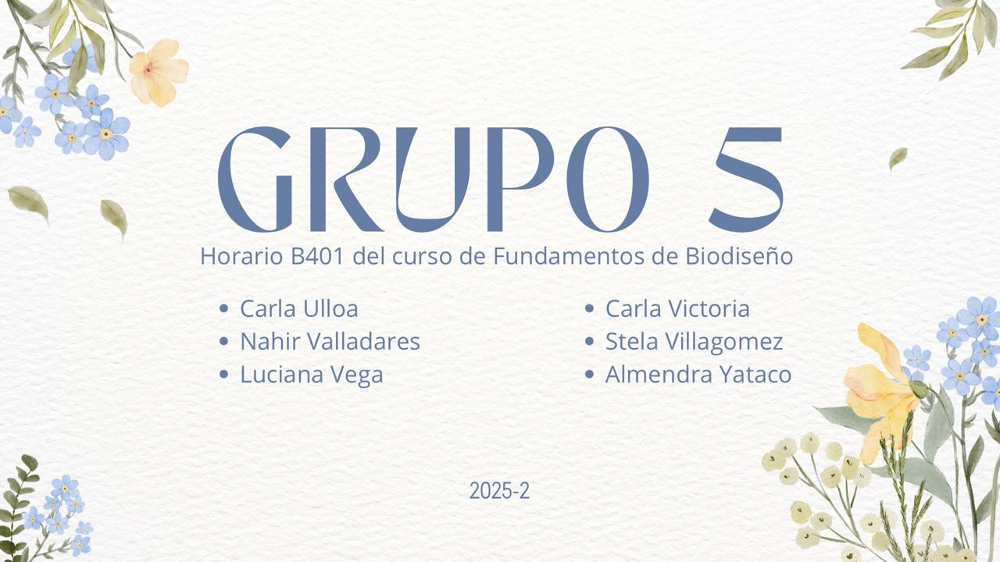
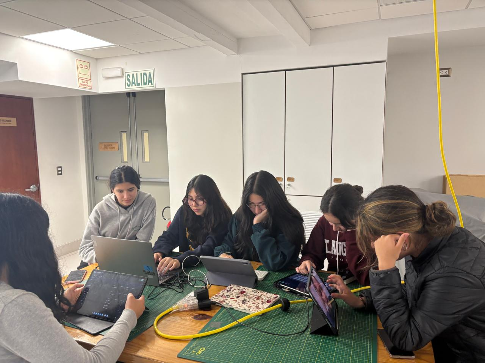

# Grupo5-Fun.Bio.
Bienvenidos al GitHub del grupo 5 :) Este repositorio contiene el proyecto realizado por el Grupo 5 de estudiantes del cuarto ciclo de Ingeniería Biomédica para el curso Fundamentos de Biodiseño.
Nuestro objetivo fue resolver un desafío real mediante el diseño y desarrollo de un dispositivo biomédico, aplicando conocimientos en electrónica, modelado 3D, investigación y prototipado.

# Presentación:)
- **Almendra Yataco**
  - **Edad:** 18 años
  - **Sobre mí:** Me gusta compartir con mis amigos y probar cosas nuevas para salir de la rutina 
  - **Rol:** Programadora
  - **Responsabilidades:**
    - Implementar movimientos y funciones
    - Probar y corregir errores del sistema
    - Integrar modelos y elementos gráficos
- **Luciana Vega**
  - **Edad:** 18 años
  - **Sobre mí:** Me encanta la tecnología aplicada a la salud. También disfruto salir con mis amigos y aprovechar cada momento al máximo.
  - **Rol:** Modeladora 3D
  - **Responsabilidades:**
    - Crear modelos tridimensionales
    - Aplicar texturas y materiales
    - Optimizar y adaptar los modelos para el proyecto
- **Nahir Valladares**
  - **Edad:** 18 años
  - **Sobre mí:** Me encanta la danza, aficionada por la ciencia y la tecnología, siempre dispuesta a aprender
  - **Rol:** Electrónica
  - **Responsabilidades:**
    - Apoyo en el desarrollo del sistema eléctrico
    - Elaboración del sistema y organización de componentes 
    - Verificación de electrónica y funcionamiento del proyecto
- **Stela Villagomez**
  - **Edad:** 18 años
  - **Sobre mí:** Me gusta escuchar música, leer y ver series. Me apasiona resolver problemas, enfrentar nuevos retos y aprender cosas nuevas.
  - **Rol:** Coordinadora General
  - **Responsabilidades:**
    - Organización y coordinación del equipo
    - Planificación y supervisión de actividades
    - Asegurar el cumplimiento de los objetivos del grupo
- **Carla Victoria**
  - **Edad:** 18 años
  - **Sobre mí:** Ingeniera biomédica enfocada en crear soluciones que unan la ciencia y la tecnología al servicio de la salud.
  - **Rol:** Investigadora
  - **Responsabilidades:**
    - Buscar información relevante para el proyecto
    - Analizar y seleccionar datos útiles
    - Compartir hallazgos con el equipo

